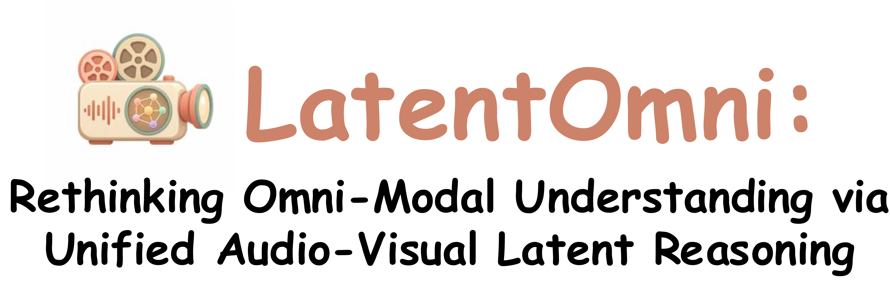
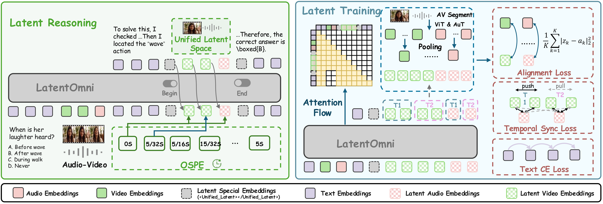
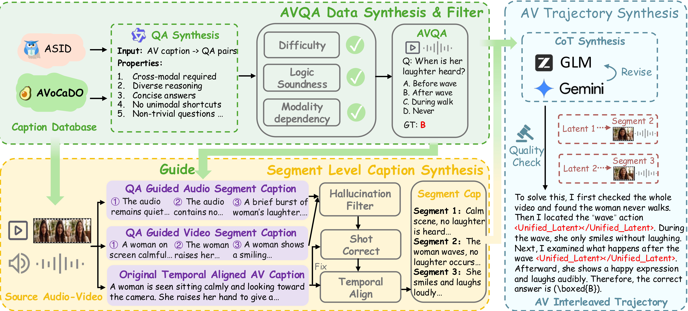
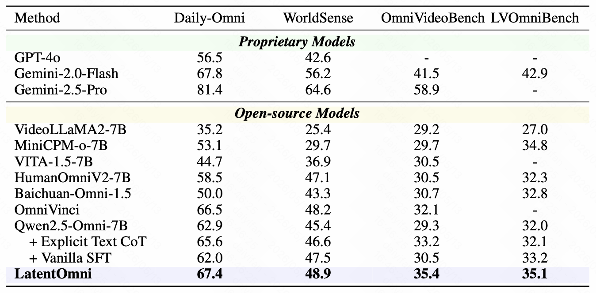
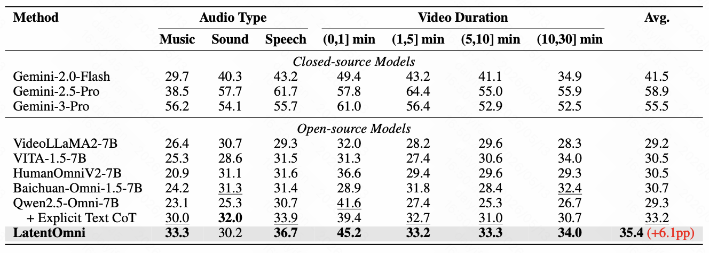
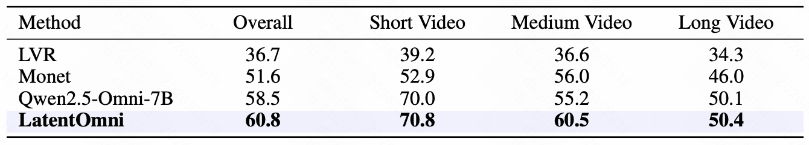
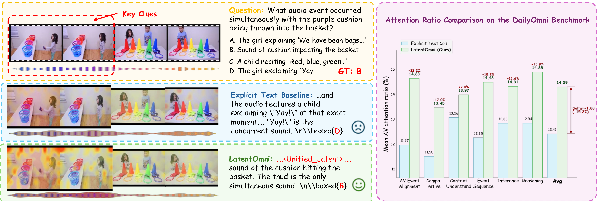
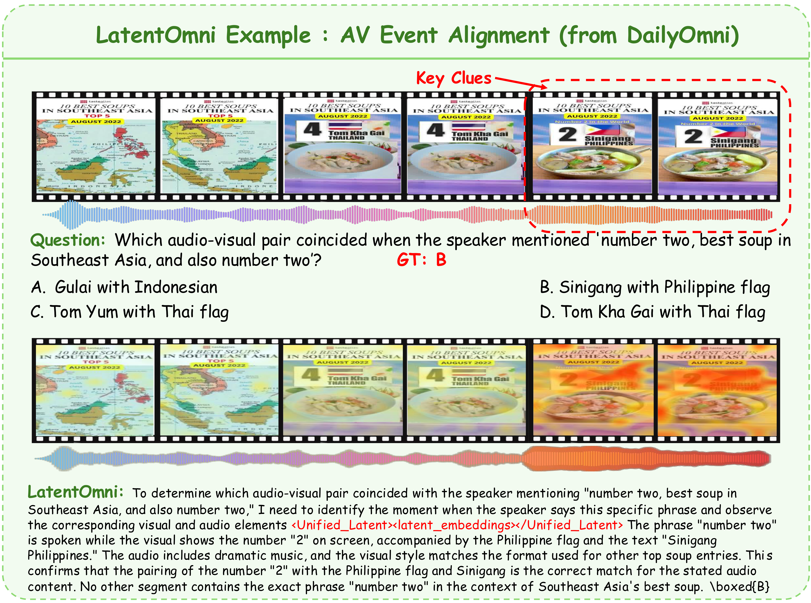

  

  
  
  
  
  

## 🔥 News

- **[2026.05.22]** We initialize the LatentOmni repository with the project overview, visual assets, and release roadmap.

## 🎯 Todo List

We are actively preparing to release the following:

- [x] Project README and Paper
- [ ] Training and inference code
- [ ] LatentOmni model checkpoints
- [ ] LatentOmni-Instruct-35K dataset

## 🎬 LatentOmni

**LatentOmni** is a cross-modal reasoning framework for audio-visual multimodal large language models. Instead of relying only on text-based chain-of-thought,  LatentOmni performs joint reasoning in a unified continuous latent space. This design preserves rich audio-visual representations and keeps the model grounded in the original sensory inputs throughout the reasoning process.

  

  <i>LatentOmni Overview. Left: A start embedding automatically triggers latent reasoning. The model autoregressively generates latent audio-visual embeddings, temporally synchronized via OSPE for precise cross-modal reasoning. Right: Training employs three specialized losses and a controlled attention flow, explicitly guiding the model to leverage latent representations for downstream reasoning.</i>

## 🔍 Contributions

- **Unified latent audio-visual reasoning.** We propose **LatentOmni**, enabling joint reasoning in a unified latent space for MLLMs.
- **Feature-level latent supervision and OSPE.** We introduce latent reconstruction supervision and Omni-Sync Position Embedding to align cross-modal temporal dynamics and preserve audio-visual attention.
- **Audio-visual interleaved CoT data synthesis.** We construct **LatentOmni-Instruct-35K**, a high-quality dataset with audio-visual interleaved reasoning trajectories.
- **Strong empirical results.** LatentOmni substantially outperforms explicit-CoT baselines on challenging audio-visual reasoning benchmarks.

## 📑 LatentOmni-Instruct-35K
LatentOmni-Instruct-35K is designed to fill the training-data gap for latent-space cross-modal reasoning. The pipeline synthesizes audio-visual question-answer pairs, filters them for reasoning difficulty, logical soundness, and modality dependency, and constructs trajectories that interleave textual reasoning with audio-visual segments.

  

  <i>LatentOmni-Instruct-35K Dataset Construction Pipeline, including AVQA Data Synthesis & Filtering, Segment-Level Caption Synthesis, and AV-Interleaved Reasoning Trajectory Synthesis.</i>

## 🚀 Quick Start

Code, checkpoint, and dataset preprocess instructions are coming soon.

## 📊 Results Analysis
### 1️⃣ Performance comparison on Omni Understanding Benchmarks

  

  <i>Performance comparison of proprietary and open-source models on Daily-Omni, WorldSense, OmniVideoBench, and LVOmniBench benchmarks. The <b>best</b> is highlighted.</i>

### 2️⃣ Fine-Grained Analysis on OmniVideoBench

  

  <i>Accuracy comparison of LatentOmni and other methods on OmniVideoBench. The <b>best</b> is highlighted and the second-best is <u>underlined</u>. Performance gains over the base model are shown in red parentheses.</i>

### 3️⃣ Performance comparison with other Latent Reasoning Methods on VideoMME

  

  <i>Performance comparison with recent visual latent reasoning methods on the VideoMME benchmark (without audio inputs). The <b>best</b> is highlighted.</i>

## 🔭 Visualizations

  
<i>Click to collapse or expand visual examples.</i>

### Audio-Visual Reasoning Comparison

  

  <i>LatentOmni maintains stronger attention to audio-visual evidence than explicit text-based CoT baselines and improves reasoning over temporally grounded cross-modal clues.</i>

### Example: Audio-Visual Event Alignment

  

  <i>A representative DailyOmni example showing how LatentOmni identifies temporally aligned audio-visual evidence before producing the final answer.</i>

## 📖 Citation

If you find this project useful, please consider citing our work. The BibTeX entry will be updated once the paper is publicly available.

## 📒 License

This repository is released under the MIT License. See [LICENSE](LICENSE) for additional details.
